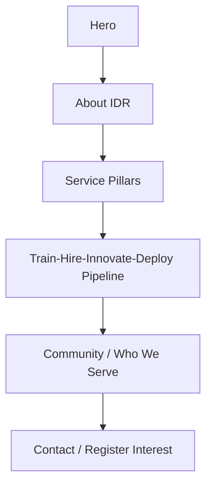
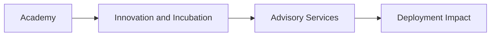
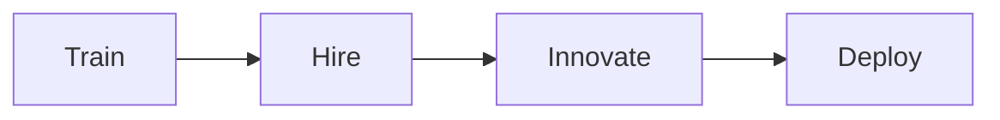
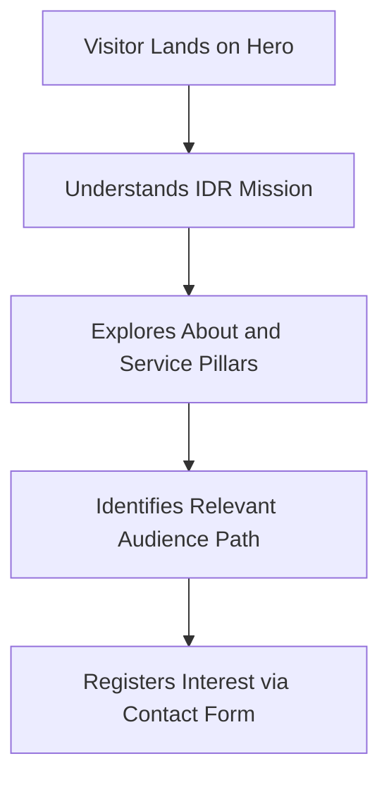

# Institute of Digital Risk (IDR) Homepage Project

## Project Summary
This project delivers a brand identity and a responsive homepage for the Institute of Digital Risk (IDR), an industry-led training and deployment institute focused on digital, cyber, technology, and AI risk.

The work combines:
- A cube-inspired logo system in two variants.
- A single-page website designed for desktop and mobile.
- A clear narrative explaining IDR's mission, model, community, and contact path.

## Project Goals
The homepage is designed to help visitors quickly understand:
- Who IDR is.
- What IDR does.
- How IDR creates value through training, innovation, and advisory work.
- Who IDR serves.
- How to register interest.

## Deliverables Included
- `idr-logo-icon.svg` (icon-only logo)
- `idr-logo-full.svg` (icon + text logo)
- `idr-homepage.html` (single-page responsive site)
- `logo-rationale.md` (design explanation for logo choices)

## Brand Direction
The IDR brand direction is minimal, technical, and professional.

Core brand signals:
- Geometric cube form to represent structure, risk, and resilience.
- Orange, black, and white as the primary color palette.
- High-contrast visual system for strong readability.
- Clean typography and deliberate spacing to support trust and clarity.

## Homepage Information Architecture
The page follows a top-to-bottom narrative that moves from identity to action.

## Section Breakdown
### 1. Hero Section
Purpose:
- Establish IDR mission and positioning immediately.
- Introduce core value proposition in one glance.
- Encourage first action through CTA buttons.

### 2. About IDR
Purpose:
- Explain IDR as an industry-led training and deployment institute.
- Emphasize the connection between UK academic partnership and real-world industry delivery.
- Build credibility for regulated and high-consequence sectors.

### 3. Service Pillars / Operating Model
Purpose:
- Present the three operating pillars clearly:
  - Academy
  - Innovation and Incubation
  - Advisory Services
- Show how these pillars connect into an end-to-end capability model.

### 4. Community / Who We Serve
Purpose:
- Define target audience groups.
- Highlight sectors where digital risk capability is critical.
- Reinforce the practical relevance of IDR pathways.

### 5. Contact / Register Interest
Purpose:
- Convert interest into action.
- Provide a simple, direct path for students, professionals, and organizations.

## Service Model Diagram

## IDR Talent Pipeline Diagram

## User Journey Diagram

## Responsive Experience
The homepage is designed to perform across desktop and mobile layouts.

Responsive behavior focuses on:
- Readable typography at different screen widths.
- Reflow of multi-column sections into single-column mobile stacks.
- Mobile navigation access through a hamburger menu.
- Preserved CTA visibility and clear section progression.

## Accessibility and Usability Considerations
The project applies practical usability standards, including:
- Semantic page structure for clearer content organization.
- Sticky navigation with smooth scrolling between sections.
- Clear visual hierarchy for fast scanning.
- Strong color contrast for readability.
- Hover and focus interaction states for key controls.

## Visual and Interaction Principles
The site experience is intentionally modern but restrained.

Interaction approach:
- Subtle reveal and motion behavior to guide attention.
- Micro-interactions on cards, links, and buttons.
- Consistent visual rhythm between sections.

## Success Criteria Alignment
This project aligns with the requested outcomes by providing:
- Dual-variant logo assets.
- A complete responsive homepage with all mandatory sections.
- Sticky navigation and smooth section linking.
- A clear call-to-action endpoint.
- Supporting documentation of brand rationale.

## Intended Audience
The project is suitable for:
- Students and early-career talent entering digital and cyber risk fields.
- Practitioners who need upskilling in AI and technology risk.
- Organizations in regulated sectors seeking trained risk professionals.
- Partners interested in academic and industry collaboration.

## Project Status
Current status: Complete initial version of brand and homepage delivery.

Potential future enhancement themes:
- Program detail pages.
- Team and partner profiles.
- Case studies and outcomes.
- Multi-page conversion with CMS integration.
